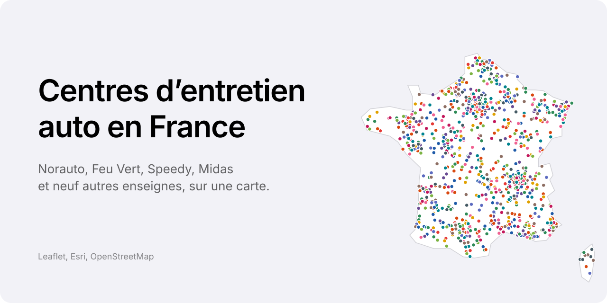

# Centres d'entretien auto en France

Carte web de tous les centres d'entretien automobile des grandes enseignes en France, outre-mer compris, avec une fiche pour chaque centre.

**[Ouvrir l'application](https://ninjathune-human.github.io/centres-auto-france/)**

## Enseignes couvertes

Norauto, Feu Vert, Speedy, Midas, Point S, Euromaster, Vulco, Profil Plus, Roady, Carter-Cash, Eurorepar, Motrio, Top Garage.

## Fonctionnalités

- Un point coloré par centre, couleur par enseigne, sur fond de carte Esri clair ou sombre selon le réglage du système.
- Fiche au clic : adresse, téléphone, page du centre, e-mail, horaires traduits en français, SIRET, itinéraire et vue de la façade dans Street View.
- Filtre par enseigne : un clic isole une enseigne, les clics suivants en ajoutent. Sans sélection, tout est affiché.
- Choix d'une région ou d'un département, et export des centres affichés en CSV (compatible Excel).
- Recherche par nom, ville ou code postal, tolérante aux fautes de frappe et à l'ordre des mots.
- Interface adaptée au PC, à l'iPad et à l'iPhone, au tactile comme au stylet.

## Données

Le fichier `centres.json` est reconstruit chaque lundi par une GitHub Action, à partir de deux sources :

- [All The Places](https://www.alltheplaces.xyz), sous licence CC0. Ce projet collecte chaque semaine les localisateurs officiels des enseignes, ce qui donne des fiches complètes (téléphone, horaires, page du centre). Enseignes concernées : Norauto, Feu Vert, Speedy, Midas, Point S, Euromaster, Motrio et Top Garage.
- [OpenStreetMap](https://www.openstreetmap.org), sous licence [ODbL](https://opendatacommons.org/licenses/odbl/), pour Vulco, Profil Plus, Roady, Carter-Cash et Eurorepar, et pour compléter les autres enseignes (centres manquants, SIRET). Les doublons entre les deux sources sont fusionnés.

Si `centres.json` est absent, par exemple quand le fichier est ouvert en local, l'application interroge directement OpenStreetMap.

Données © contributeurs OpenStreetMap et All The Places. Fond de carte © Esri.

## Déploiement

1. Déposer les fichiers à la racine du dépôt, en conservant les dossiers `.github/workflows/` et `scripts/`.
2. Dans *Settings > Pages*, choisir *GitHub Actions* comme source.
3. Dans l'onglet *Actions*, lancer « Données et publication » avec *Run workflow*. Ensuite, la mise à jour se fait seule chaque lundi et à chaque modification du dépôt.
4. L'application est en ligne à l'adresse `https://ninjathune-human.github.io/centres-auto-france/`.

Pour l'aperçu sur les réseaux sociaux, importer `banner.png` dans *Settings > General > Social preview*.

## Technique

[Leaflet](https://leafletjs.com) 1.9.4 avec rendu Canvas, tuiles Esri World Gray Canvas. Application en HTML, CSS et JavaScript natifs, en un seul fichier. Collecte des données en Python, sans dépendance externe.
